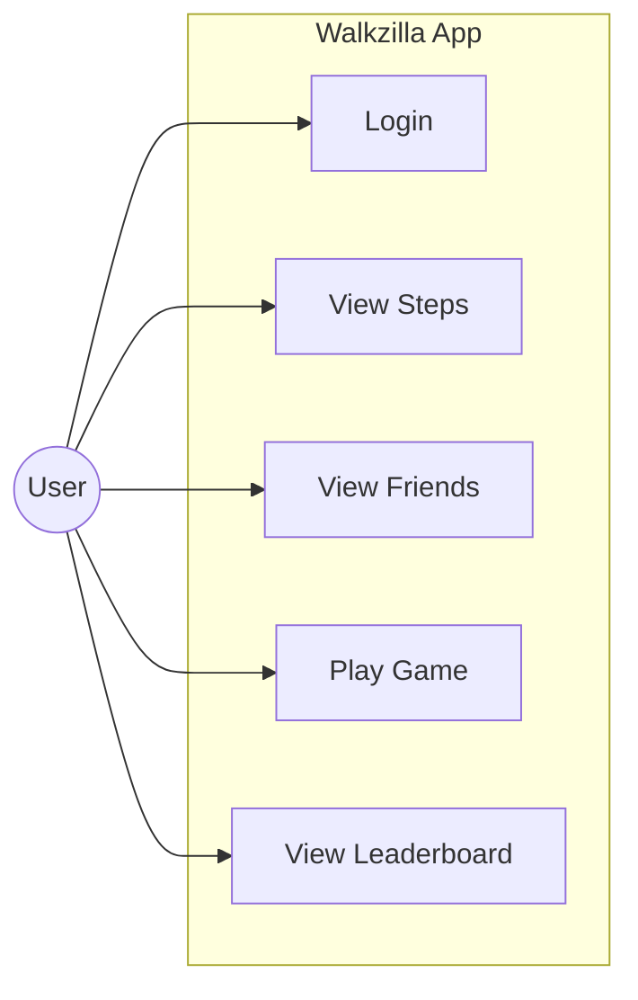

# Walkzilla App Use Case Diagram

## MermaidJS Version (Simplified & Compatible)

```mermaid
graph TD
    %% Actor
    User((User))
    
    %% System Boundary
    subgraph System["Walkzilla Fitness & Social Gaming App"]
        %% Authentication
        Login[Login]
        SignUp[Sign Up]
        Logout[Logout]
        ForgotPassword[Forgot Password]
        EmailVerification[Email Verification]
        UpdateProfile[Update Profile]
        DeleteAccount[Delete Account]
        
        %% Fitness
        ViewSteps[View Steps]
        ViewCalories[View Calories]
        ViewDistance[View Distance]
        SetDailyGoal[Set Daily Goal]
        ViewDashboard[View Dashboard]
        RealTimeSync[Real-time Sync]
        HealthPermission[Health Permission Dialog]
        
        %% Social
        ViewFriends[View Friends]
        SendFriendRequest[Send Friend Request]
        AcceptFriendRequest[Accept Friend Request]
        FriendNotification[Friend Request Notification]
        
        %% Chat
        StartChat[Start Chat]
        SendMessage[Send Message]
        
        %% Gaming
        PlaySolo[Play Solo Mode]
        JoinChallenge[Join Challenge]
        InviteChallenge[Invite Friend to Challenge]
        PlayMiniGame[Play Mini Game]
        ChallengeNotification[Challenge Invite Notification]
        
        %% Rewards
        ViewLeaderboard[View Leaderboard]
        CollectReward[Collect Daily Reward]
        ViewStats[View Stats]
        RewardNotification[Reward Notification]
        
        %% Settings
        ViewSettings[View Settings]
        UpdateSettings[Update Settings]
        ViewNotifications[View Notifications]
    end
    
    %% Actor connections
    User --> Login
    User --> SignUp
    User --> Logout
    User --> UpdateProfile
    User --> DeleteAccount
    User --> ViewSteps
    User --> ViewCalories
    User --> ViewDistance
    User --> SetDailyGoal
    User --> ViewDashboard
    User --> ViewFriends
    User --> SendFriendRequest
    User --> AcceptFriendRequest
    User --> StartChat
    User --> SendMessage
    User --> PlaySolo
    User --> JoinChallenge
    User --> InviteChallenge
    User --> PlayMiniGame
    User --> ViewLeaderboard
    User --> CollectReward
    User --> ViewStats
    User --> ViewSettings
    User --> UpdateSettings
    User --> ViewNotifications
    
    %% Include relationships
    Login -.-> ForgotPassword
    SignUp -.-> EmailVerification
    ViewSteps -.-> RealTimeSync
    SendFriendRequest -.-> FriendNotification
    InviteChallenge -.-> ChallengeNotification
    CollectReward -.-> RewardNotification
    
    %% Extend relationships
    ViewSteps -.-> HealthPermission
    ViewCalories -.-> HealthPermission
    ViewDistance -.-> HealthPermission
```

## Alternative: Ultra-Simple Version

If the above still doesn't work, try this minimal version:

## Manual Draw.io Instructions

If MermaidJS continues to have issues, here's how to create it manually in draw.io:

### Step 1: Create System Boundary
1. Draw a large rectangle
2. Label it "Walkzilla Fitness & Social Gaming App"

### Step 2: Add Actor
1. Draw a stick figure outside the system boundary
2. Label it "User"

### Step 3: Add Use Cases (Ovals)
Inside the system boundary, create ovals for:

**Authentication:**
- Login
- Sign Up
- Logout
- Forgot Password
- Email Verification
- Update Profile
- Delete Account

**Fitness Tracking:**
- View Steps
- View Calories
- View Distance
- Set Daily Goal
- View Dashboard
- Real-time Sync
- Health Permission Dialog

**Social Features:**
- View Friends
- Send Friend Request
- Accept Friend Request
- Friend Request Notification

**Chat System:**
- Start Chat
- Send Message

**Gaming:**
- Play Solo Mode
- Join Challenge
- Invite Friend to Challenge
- Play Mini Game
- Challenge Invite Notification

**Rewards & Statistics:**
- View Leaderboard
- Collect Daily Reward
- View Stats
- Reward Notification

**Settings:**
- View Settings
- Update Settings
- View Notifications

### Step 4: Add Relationships
1. **Solid lines**: Connect User actor to all primary use cases
2. **Dashed lines with arrows**: Include relationships
   - Login → Forgot Password
   - Sign Up → Email Verification
   - View Steps → Real-time Sync
   - Send Friend Request → Friend Request Notification
   - Invite Friend to Challenge → Challenge Invite Notification
   - Collect Daily Reward → Reward Notification
3. **Dotted lines with arrows**: Extend relationships
   - View Steps → Health Permission Dialog
   - View Calories → Health Permission Dialog
   - View Distance → Health Permission Dialog

### Step 5: Add Labels
- Label include relationships with "<<include>>"
- Label extend relationships with "<<extend>>"

## Use Case Descriptions

### Primary Use Cases:
1. **Login**: User authenticates to access the app
2. **View Steps**: User sees their step count and progress
3. **View Friends**: User sees their friend list
4. **Play Game**: User engages in solo or challenge games
5. **View Leaderboard**: User sees rankings and statistics

### Include Relationships:
- **Login includes Forgot Password**: When login fails, user can reset password
- **View Steps includes Real-time Sync**: Step data is continuously updated
- **Send Friend Request includes Friend Request Notification**: Notifications are sent automatically

### Extend Relationships:
- **View Steps extends Health Permission Dialog**: Permission dialog appears when needed
- **View Calories extends Health Permission Dialog**: Same permission handling
- **View Distance extends Health Permission Dialog**: Same permission handling 